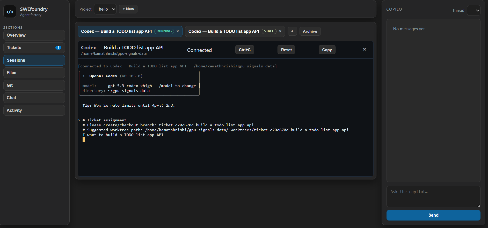

# SWEfoundry

SWEfoundry is a local-first web app for running and coordinating multiple terminal coding agents (`codex`, `claude`, and shell) across software projects.

It gives you one place to plan work, break it into tickets, run parallel agent sessions, and monitor Git progress.



## Features

- Manage multiple coding-agent terminal sessions in one workspace.
- Organize work as `Projects -> Tickets -> Sessions`.
- Link tickets to branch/worktree intent and inject ticket context into sessions.
- Inspect project files and read-only Git views (status, branches, diff, log).
- Use built-in copilot/chat workflows for project and ticket operations.
- Track activity and chat history in SQLite.

## Product model

- `Project`: repository-level context and overview.
- `Ticket`: task spec, success criteria, and branch/worktree intent.
- `Session`: a Codex/Claude/Shell process associated with ticket context.

## Architecture

- Frontend: React + Vite + `xterm` (`frontend/`)
- Backend: FastAPI + WebSocket + PTY runner (`backend/`)
- DB: SQLite (`backend/swefoundry.db`)
- Logs: rotating backend log (`backend/swefoundry.log`)

When `frontend/dist` exists, the backend serves the built frontend.

## Requirements

- Linux, macOS, or WSL with `/bin/bash` and PTY support.
- Node.js + npm.
- Python 3.10+.
- Optional: `codex` and/or `claude` binaries on `PATH`.

## Quick start

### 1) Build frontend

```bash
cd frontend
npm install
npm run build
```

### 2) Start backend

```bash
cd backend
python3 -m venv .venv
source .venv/bin/activate
pip install -r requirements.txt
uvicorn main:app --reload --port 8001
```

Open `http://127.0.0.1:8001`.

## Environment variables

- `OPENAI_API_KEY`: required for copilot endpoint (`/api/copilot/query`).
- `OPENAI_MODEL`: optional model override (default: `gpt-4.1-mini`).
- `LOG_LEVEL`: backend log level (`INFO` default, `DEBUG` for deeper traces).

Example:

```bash
cd backend
OPENAI_API_KEY=... OPENAI_MODEL=gpt-4.1-mini LOG_LEVEL=DEBUG uvicorn main:app --reload --port 8001
```

## API surface

- Sessions: create/list/archive/delete.
- Projects: create/list/update/delete and browse files.
- Tickets: create/list/update/delete and assign to sessions.
- Git (read-only): status, branches, diff, log.
- Chat/Copilot: threads, messages, and copilot query.
- Activity: project/session timeline feed.

## Troubleshooting

### Agent terminal reports `dumb`

SWEfoundry sets `TERM=xterm-256color` for launched sessions. Start a fresh session after backend restart and verify the agent CLI is not overriding `TERM`.

### Session output looks wrong

Start backend with debug logging:

```bash
LOG_LEVEL=DEBUG uvicorn main:app --reload --port 8001
```

Then inspect logs:

```bash
tail -f backend/swefoundry.log
```

### Frontend changes are not visible

Rebuild frontend and restart backend:

```bash
cd frontend && npm run build
cd backend && pkill -f 'uvicorn main:app --reload --port 8001' || true
cd backend && uvicorn main:app --reload --port 8001
```

## Security note

Authentication and multi-user isolation are not implemented yet. Run this only on trusted local/dev networks.

## Roadmap

- Stronger multi-agent orchestration (handoffs, delegation, automation hooks).
- Deeper planning integration.
- Richer usage analytics and prompt guidance from project and cross-agent context.
